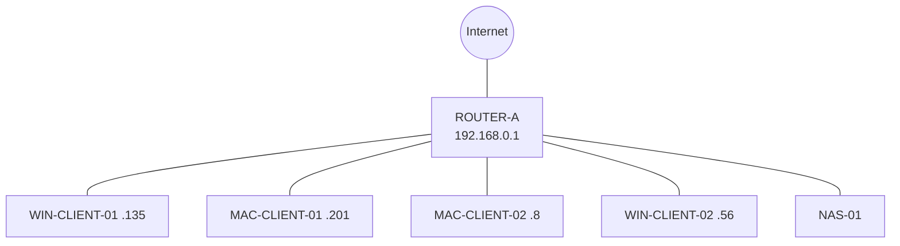
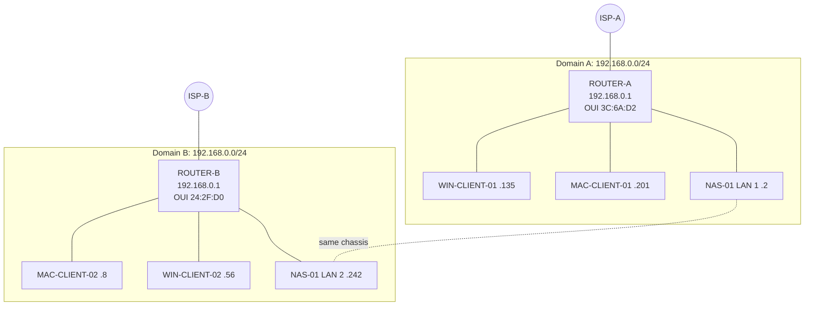
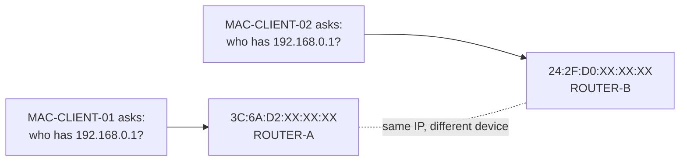
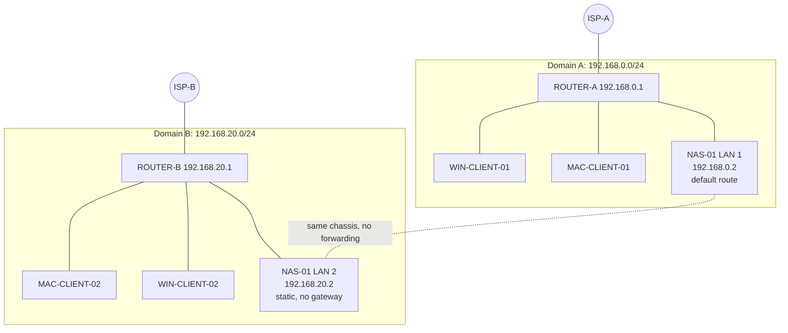

# Topology diagrams

The Mermaid diagrams below are the reference versions. They are text, so they render on GitHub, can be diffed, and use sanitized labels. The PNGs in this folder are the original hand-made diagrams from the July round and are kept as a record of how the understanding changed.

## 1. What was assumed

One network, one gateway, everything can reach everything.

## 2. What discovery showed

Two independent routers, each with its own ISP, both handing out `192.168.0.0/24` and both calling themselves `192.168.0.1`. NAS-01 has one leg in each LAN.

## 3. Root cause in one picture

The same Layer 3 identity maps to two different Layer 2 devices. Nothing is "broken" inside either LAN, which is why it went unnoticed.

## 4. Remediated design

ROUTER-B moved to `192.168.20.0/24`. NAS-01 LAN 2 is static at `192.168.20.2` with **no gateway**, so NAS-01 keeps a single default route via Domain A. The two domains are still deliberately not connected to each other.

## Legacy PNGs

| File | Status |
|---|---|
| `01_Windows-scan_5-devices.png` | Historical. Shows the single-router assumption. |
| `02_Windows+Mac_combined.png` | Historical. Two Domain A scans merged. |
| `03_Discovered_dual-LAN_subnet-conflict.png` | Accurate for July 2026. MACs are blacked out. |
| `04_Target-state_subnet-remediation.png` | Accurate target design. |
| `05_Summary_infographic_conflict-and-remediation.png` | **Contains errors, kept for the record only.** It says NAS-01 "bridges" the two segments. The design explicitly rejects bridging, and the NAS does not forward between its interfaces. It calls the overlap a "critical IP conflict", but the routers were in separate broadcast domains, so no live IP conflict occurred. It also mentions "exposed wireless credentials in photographs", which is unrelated to this assessment and not supported by any evidence in this repository. |
