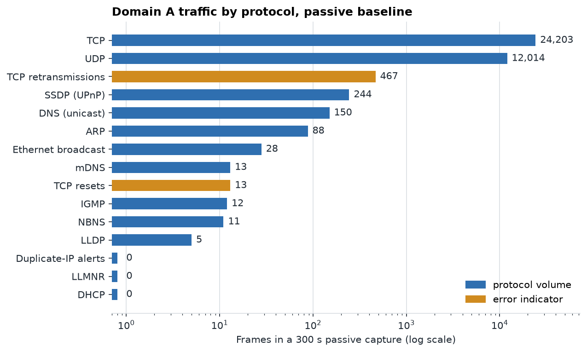
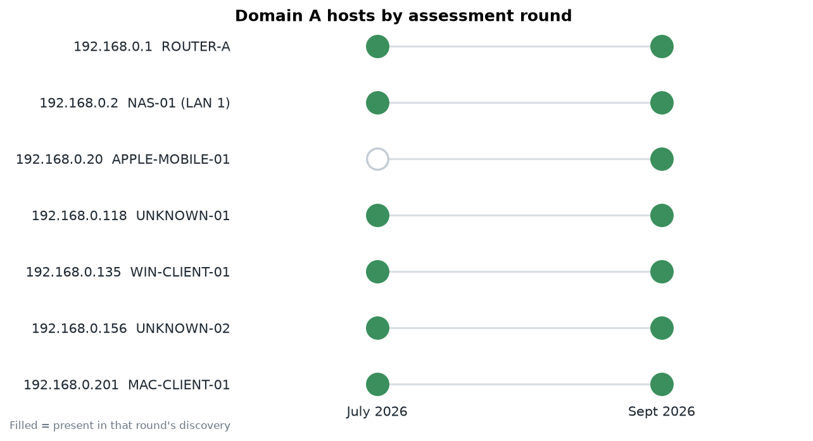

# Live re-assessment, 28 September 2026

Post-remediation check of Domain A from WIN-CLIENT-01 (`192.168.0.135`, wired). All scans were read-only and limited to RFC 1918 addresses. Raw captures and Nmap XML stay local; everything here is generated from them by the tools in [`tools/`](../tools/).

## Sequence

| Step | Tool |
|---|---|
| Passive baseline capture (300 s), before any active scan | tshark |
| Host baseline: adapters, routes, gateway MAC, DNS, TCP states | `Get-NetworkBaseline.ps1` |
| ARP host discovery, `192.168.0.0/24` | Nmap `-sn -PR` |
| Full TCP sweep (65,535 ports), service and OS detection, safe NSE only | Nmap `-sS -p- -sV -O` |
| UDP top 50 ports | Nmap `-sU` |
| Negative test against the Domain B addresses | Nmap `-sn -PE -PS22,80,443,5001` |
| Passive capture after scanning (120 s) | tshark |
| Broadcast discovery: DHCP, SSDP/UPnP, WS-Discovery, IGMP (re-run 29 Sep) | Nmap `broadcast-*` |

## Results

| Check | Result |
|---|---|
| Devices answering ARP for `192.168.0.1` | **1** (`3C:6A:D2`, TP-Link) in both captures |
| DHCP servers answering a DHCPDISCOVER | **1** (`192.168.0.1`) |
| Wireshark duplicate-address alerts | **0** |
| Default routes on the scanning host | **1** |
| Adapter errors and discards | **0** |
| DNS: resolver, mean response time, errors | `192.168.0.1` only, 13.6 ms, 1 NXDOMAIN in 75 queries |
| NAS-01 LAN 2 address, from its own SSDP advertisement | **`192.168.20.2`** |
| `192.168.20.1` and `192.168.20.2` reachable from Domain A | **No** (ICMP and TCP SYN, 0 of 2 up) |
| Live hosts on Domain A | 6 by active scan, plus 1 more seen passively |

TCP retransmissions were 467 in the baseline capture, 88% of them on a single internet download. The post-scan capture had 4. Neither points to a LAN fault.

## Inventory

Sanitized with [`nmap_inventory.py`](../tools/parsers/nmap_inventory.py): OUI-only MACs, asset IDs instead of hostnames. Full table: [`data/inventory.csv`](data/inventory.csv).

| Asset | IP | Vendor (OUI) | OS guess | Open services |
|---|---|---|---|---|
| ROUTER-A | `.1` | TP-Link | Linux / OpenWrt-based | DNS, DHCP, HTTP 80, HTTPS 443, **UPnP 1900**, 30001 |
| NAS-01 | `.2` | Synology | Linux | SSH, SMB, DSM 5000/5001, iSCSI 3261-3265, NTP, mDNS |
| APPLE-MOBILE-01 | `.20` | randomized MAC | Apple OS | AirPlay 5000/7000, mDNS |
| UNKNOWN-01 | `.118` | Elitegroup | Linux | 5005, 65527 |
| WIN-CLIENT-01 | `.135` | scanning host | Windows 11 | RPC, SMB, Windows services |
| MAC-CLIENT-01 | `.201` | Apple | not reliable | none: all 65,535 TCP ports filtered |
| UNKNOWN-02 | `.156` | not captured | not scanned | seen passively after the scan window |

## Charts

## Data files

| File | Content |
|---|---|
| `data/inventory.csv` | Nmap inventory, sanitized |
| `data/packet_filter_counts.csv`, `data/packet_filter_counts_post_scan.csv` | Frame counts per display filter, before and after scanning |
| `data/arp_bindings_baseline.csv`, `data/arp_bindings_post_scan.csv` | IP to MAC (OUI) bindings seen in ARP |
| `data/vantage_matrix.csv` | What each scanning host could see, both rounds |
| `data/domain_a_hosts_july_vs_sept.csv` | Domain A hosts by round |

Regenerate the charts with `python tools/charts/make_charts.py`.
