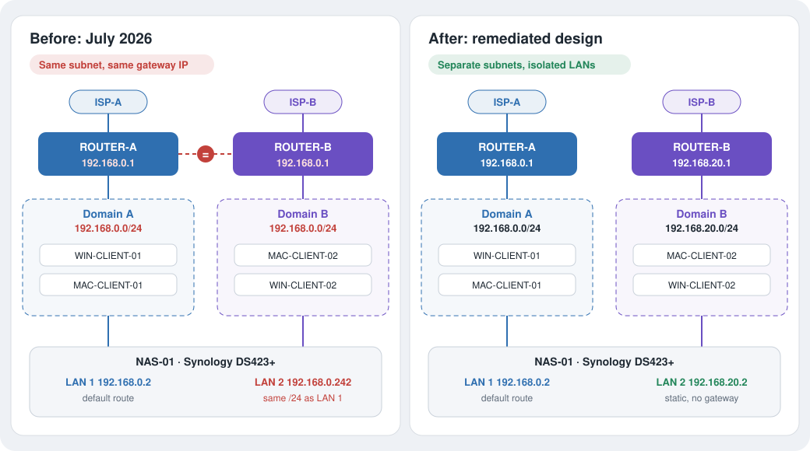
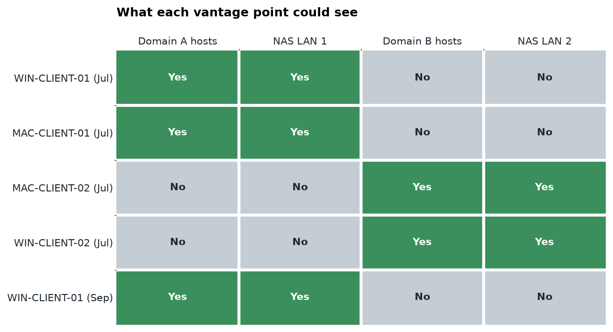

<p align="center">
  
</p>

<p align="center">
  <a href="https://github.com/VijaysinghPuwar/Dual-ISP-Network-Assessment-and-Subnet-Remediation/actions/workflows/quality.yml"></a>
  
  
  
  
  
</p>

A home network with **two routers on two ISP lines** and a **NAS cabled to both** had inventories that contradicted each other depending on which computer ran the scan. I traced it to both routers using the same factory subnet and gateway (`192.168.0.1/24`), which made two separate LANs look identical at Layer 3. I moved the second LAN to `192.168.20.0/24`, then re-validated from the live network with Nmap, Wireshark and PowerShell.

## Highlights

- **Root cause found at Layer 2.** Two hosts asked for `192.168.0.1` and got two different vendor MACs. Same IP, two routers.
- **Multi-vantage method.** Inventories from four machines on two LANs, compared side by side.
- **Fix validated with evidence.** One gateway MAC, one DHCP server, zero duplicate addresses, and the NAS's new `192.168.20.2` confirmed but unreachable from the other LAN.
- **Built the tooling.** Cross-platform scanners (PowerShell, Bash), a baseline collector, a packet summarizer, an Nmap-to-inventory parser, and a privacy gate, all tested in CI.

## Architecture

<p align="center">
  
</p>

| | Before | After |
|---|---|---|
| ROUTER-B LAN | `192.168.0.0/24`, gateway `.1` | `192.168.20.0/24`, gateway `.1` |
| NAS-01 LAN 2 | `192.168.0.242`, same /24 as LAN 1 | `192.168.20.2` static, no gateway |
| Result | Two LANs, one identity, asymmetric NAS replies | Two isolated LANs, one NAS default route |

## Results

| Check (Sept 2026, from Domain A) | Result |
|---|---|
| Devices answering ARP for the gateway | 1 |
| DHCP servers on the segment | 1 |
| Duplicate-address alerts | 0 |
| NAS-01 LAN 2 address (from its SSDP advertisement) | `192.168.20.2` |
| Domain B reachable from Domain A | No |

<p align="center">
  
</p>

Full results, inventory and charts: [`08_Live_Assessment_2026-09-28/`](08_Live_Assessment_2026-09-28/).

## Findings

| Severity | Finding | Status |
|---|---|---|
| High | Both routers on `192.168.0.0/24` with gateway `192.168.0.1` | Remediated |
| Medium | UPnP IGD enabled on the Domain A router | Open |
| Low | NAS services (SSH, SMB, iSCSI, DSM over HTTP) open to the whole LAN | Open |
| Low | NAS advertises its Domain B address into Domain A | Open |

Details and recommendations: [`docs/findings.md`](docs/findings.md).

## Tools

| Tool | Language | Purpose |
|---|---|---|
| [`Home_Network_Inventory_v1.5.ps1`](01_Scanner_Scripts/Home_Network_Inventory_v1.5.ps1) | PowerShell | Windows LAN inventory: discovery, ports, HTML/CSV/JSON report |
| [`Mac_Network_Inventory_v1.1.sh`](01_Scanner_Scripts/Mac_Network_Inventory_v1.1.sh) | Bash 3.2 | macOS port of the same scanner |
| [`Get-NetworkBaseline.ps1`](tools/windows/Get-NetworkBaseline.ps1) | PowerShell | Adapters, routes, gateway MAC, ARP, DNS, TCP states, connectivity |
| [`Invoke-PacketSummary.ps1`](tools/windows/Invoke-PacketSummary.ps1) | PowerShell + tshark | Metadata-only capture analysis: ARP bindings, DNS, retransmissions |
| [`nmap_inventory.py`](tools/parsers/nmap_inventory.py) | Python | Nmap XML to sanitized asset inventory |
| [`Test-PublicArtifacts.ps1`](tools/privacy/Test-PublicArtifacts.ps1) | PowerShell | Pre-publish check for MACs, public IPs, SIDs, secrets |

```powershell
.\tools\windows\Get-NetworkBaseline.ps1 -OutputDirectory .\artifacts
.\tools\windows\Invoke-PacketSummary.ps1 -CaptureFile capture.pcapng -OutputDirectory .\artifacts\public
python tools\parsers\nmap_inventory.py --vantage WIN-CLIENT-01 --csv inventory.csv scan.xml
.\tools\privacy\Test-PublicArtifacts.ps1 -TrackedOnly
```

All tools are read-only. Run them only on networks you own or are authorized to test.

## Repository

| Path | Contents |
|---|---|
| [`00_START_HERE/`](00_START_HERE/Context_Brief.md) | One-page context brief |
| [`01_Scanner_Scripts/`](01_Scanner_Scripts/) | Windows and macOS inventory scanners |
| [`02_Scan_Results/`](02_Scan_Results/) | July scans, one folder per vantage point |
| [`03_System_Diagnostics/`](03_System_Diagnostics/) | Diagnostic summary for the host that blocked ping |
| [`04_Topology_Diagrams/`](04_Topology_Diagrams/) | Topology diagrams, July to target state |
| [`05_Report/`](05_Report/) | IEEE-style report (PDF) and slides |
| [`06_Presentation/`](06_Presentation/) | Visual slide deck |
| [`07_Media/`](07_Media/) | Audio explainer |
| [`08_Live_Assessment_2026-09-28/`](08_Live_Assessment_2026-09-28/) | September re-assessment: data and charts |
| [`docs/`](docs/) | [Methodology](docs/methodology.md), [root cause](docs/root-cause-analysis.md), [validation](docs/validation.md), [troubleshooting playbook](docs/troubleshooting-playbook.md), [privacy](docs/privacy-and-sanitization.md) |
| [`tools/`](tools/), [`tests/`](tests/) | Tooling with Pester and pytest suites |

## Privacy

Hostnames are replaced with asset IDs, MAC addresses are cut to the vendor prefix, and public IPs, raw captures and raw Nmap output are never committed. A privacy check runs on every push. See [`docs/privacy-and-sanitization.md`](docs/privacy-and-sanitization.md).

---

**Vijaysingh Puwar** · [GitHub](https://github.com/VijaysinghPuwar)
