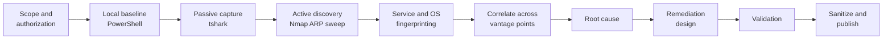

# Assessment methodology

This is the procedure used for both assessment rounds (July 2026 discovery and the September 2026 re-assessment). It is written so someone else could repeat it on a network they are authorized to test.

## 1. Scope and authorization

- Owner-authorized home network, two consumer routers on two separate ISP services, one dual-homed NAS.
- In scope: the directly connected RFC 1918 prefix of each scanning host (`192.168.0.0/24`), the VirtualBox host-only prefix on WIN-CLIENT-01 (`192.168.56.0/24`), and the two planned remediation addresses (`192.168.20.1`, `192.168.20.2`).
- Out of scope: any public address, the ISPs' equipment, and anything beyond the first routed hop.
- Before each scan, the target was checked against the scanning host's own interface prefix, and was confirmed to be RFC 1918.

## 2. Rules of engagement

Read-only throughout. No credentials were tried, no configuration was changed on any router, NAS or endpoint, and no exploit, brute-force, DoS or intrusive NSE category was run. Installing Nmap/Npcap and Wireshark on the scanning workstation was the only change made to any system.

## 3. Local host baseline (passive, host-only)

Tool: [`tools/windows/Get-NetworkBaseline.ps1`](../tools/windows/Get-NetworkBaseline.ps1), built on `Get-NetIPConfiguration`, `Get-NetRoute`, `Get-NetNeighbor`, `Get-NetTCPConnection`, `Get-DnsClientServerAddress`, `Get-NetAdapterStatistics`, `Get-NetIPInterface`, `Test-Connection`, `Resolve-DnsName` and `Test-NetConnection`. The same data is available from `ipconfig /all`, `route print`, `arp -a` and `netstat -ano`, which were also captured locally for cross-checking.

| Question | Where the answer comes from |
|---|---|
| Which prefix am I on? | Interface address + prefix length, reduced to a network address |
| Who is my gateway, and what is its MAC? | Default route next hop, then the neighbor cache entry for it |
| Is there more than one default route? | Count of `0.0.0.0/0` routes (two would mean asymmetric egress) |
| Which resolver do I use? | DNS client server list per interface |
| Is the link clean? | Adapter error and discard counters |
| Does the path work end to end? | Gateway echo, a DNS lookup, and TCP/80 to Windows' own connectivity-check host |

## 4. Passive packet capture

Tool: `tshark` (Wireshark 4.6), capture on the wired interface only, **before** any active scan so the baseline is not polluted by scan traffic. A second, shorter capture was taken after scanning.

Analysis is metadata only and is automated by [`tools/windows/Invoke-PacketSummary.ps1`](../tools/windows/Invoke-PacketSummary.ps1):

| Display filter | Why it matters here |
|---|---|
| `arp`, `arp.opcode==1/2` | Who asks for and who answers for each IP. The key test: does more than one MAC answer for the gateway address? |
| `arp.src.proto_ipv4==0.0.0.0` | RFC 5227 probes. A host checking for a duplicate address before using it |
| `arp.duplicate-address-detected` | Wireshark's own duplicate-IP detection |
| `dhcp` | Which server hands out leases, and from which scope |
| `dns && !mdns`, `dns.time` | Which resolver clients use, error rate, response time |
| `mdns`, `llmnr`, `nbns`, `ssdp` | Name-service and discovery chatter. Shows which hosts are present even when they drop probes |
| `tcp.analysis.retransmission`, `tcp.flags.reset==1` | Loss and aborted connections, and whether they are local or upstream |
| `eth.dst==ff:ff:ff:ff:ff:ff`, `eth.dst[0]&1` | Broadcast and multicast load: the size of the broadcast domain in practice |

Windows also ships `pktmon` (`pktmon start --capture --pkt-size 0 -f capture.etl`, then `pktmon etl2pcap capture.etl`). It is a workable fallback where Wireshark cannot be installed. It was not needed for this assessment.

## 5. Active discovery (Nmap 7.99)

| Scan | Command (target shown generically) | Why | Traffic generated | Limitations |
|---|---|---|---|---|
| ARP host discovery | `nmap -sn -PR -n --reason <local /24>` | Most reliable way to enumerate a directly connected segment. Hosts cannot ignore ARP and still use the network | One ARP request per address | Sees only the local broadcast domain. It is blind to the other router's LAN by design |
| Full TCP service scan | `nmap -sS -p- -T4 -sV -O --osscan-guess --script "(default or discovery) and safe and not external and not broadcast" --reason <live hosts>` | Complete inventory of listening TCP services, their versions, and an OS family guess | SYN to all 65,535 ports per live host, plus version probes and safe NSE scripts | Host firewalls produce `filtered`. OS guesses are statistical, not proof |
| UDP top ports | `nmap -sU --top-ports 50 -sV --version-light <live hosts>` | DNS, DHCP, SSDP, mDNS, NetBIOS and similar UDP services | Protocol-specific UDP probes | Closed and filtered ports look alike. `open\|filtered` is not treated as evidence |
| Broadcast discovery | `nmap -e <iface> --script "broadcast-dhcp-discover,broadcast-dns-service-discovery,broadcast-upnp-info,broadcast-netbios-master-browser,broadcast-wsdd-discover,broadcast-igmp-discovery"` | Counts DHCP servers on the segment and lists devices that advertise services even if they ignore unicast probes | One DHCPDISCOVER (no lease is requested), multicast queries, then listening | Only what devices choose to announce |
| Remediation targets | `nmap -sn -PE -PS22,80,443,5001 -n 192.168.20.1 192.168.20.2` | Negative test: Domain B's new addresses should **not** be reachable from Domain A | Echo and SYN probes to two addresses | A failure here cannot tell "isolated" apart from "absent"; see [validation](validation.md) |

The NSE expression deliberately excludes `intrusive`, `vuln`, `exploit`, `brute`, `dos` and `external` scripts. `external` would send data to third-party services.

**False positives to expect:** Nmap vendor names come from the MAC OUI and are wrong for randomized MACs. `-sV` can label an unknown service with the closest match. OS detection needs one open and one closed port to be reliable.

## 6. Cross-platform inventory (July round)

The original custom scanners ([`01_Scanner_Scripts/`](../01_Scanner_Scripts/)) were run from three hosts on both LANs. Each performs an ICMP sweep, merges the ARP cache, tests a fixed list of TCP ports, and exports HTML/CSV/JSON. The ARP merge matters: it is what recovered hosts that drop ICMP.

## 7. Correlation and root cause

Results are compared across vantage points in the [root cause analysis](root-cause-analysis.md#multi-vantage-evidence), where every conclusion is labelled **Observed**, **Inferred** or **Not tested**. Each post-fix check is listed in [validation](validation.md).

## 8. Sanitization and publication

See [privacy and sanitization](privacy-and-sanitization.md). Raw captures, raw Nmap output and full MACs stay local. The repository holds summaries generated from them, and a privacy check runs in CI on every push.
