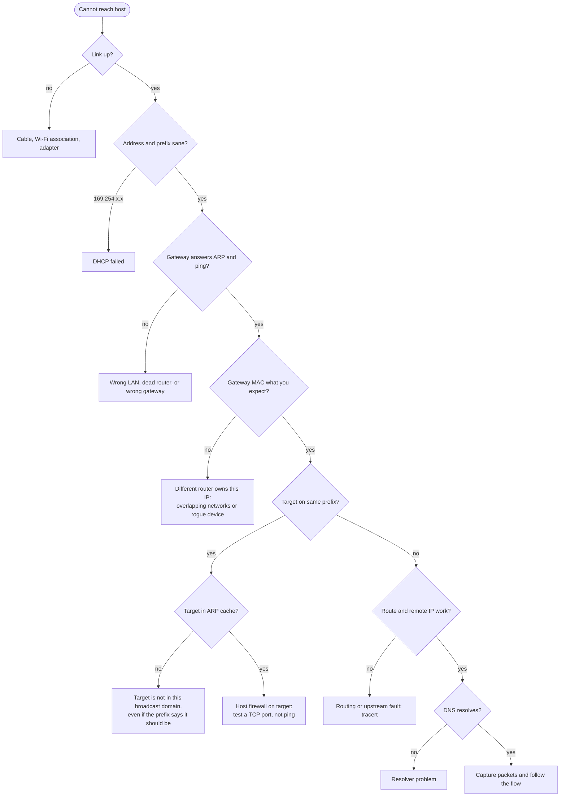

# Troubleshooting playbook: "I can't reach that host"

A bottom-up checklist that would have found this project's fault in minutes instead of weeks. Each step lists the Windows and macOS command and what a bad result means.



## 1. Is the interface up?

| Windows | macOS |
|---|---|
| `Get-NetAdapter \| Format-Table Name, Status, LinkSpeed` | `ifconfig en0 \| grep status` / `networksetup -listallhardwareports` |

## 2. Address and prefix

| Windows | macOS |
|---|---|
| `Get-NetIPAddress -AddressFamily IPv4` | `ipconfig getifaddr en0; ipconfig getoption en0 subnet_mask` |

`169.254.x.x` means DHCP failed. Also write down the network address: two hosts "on 192.168.0.0/24" are only on the same network if they share a broadcast domain, which step 4 checks.

## 3. Gateway and default route

| Windows | macOS |
|---|---|
| `Get-NetRoute -DestinationPrefix 0.0.0.0/0` | `route -n get default` |
| `Test-Connection 192.168.0.1 -Count 2` | `ping -c 2 192.168.0.1` |

More than one default route means the host can leave by two paths. Check the metrics.

## 4. Who actually owns the gateway address? (the step that finds overlap)

| Windows | macOS |
|---|---|
| `Get-NetNeighbor -IPAddress 192.168.0.1` | `arp -n 192.168.0.1` |

Compare the MAC (at least the OUI) with the router you think you are using. In this project, two hosts both used `192.168.0.1`, but one got a `3C:6A:D2` MAC back and the other a `24:2F:D0` MAC. Same IP, two different routers. **Layer 3 alone cannot see this; Layer 2 can.**

## 5. Is the target in this broadcast domain?

| Windows | macOS |
|---|---|
| `Test-Connection <target>`, then `Get-NetNeighbor -IPAddress <target>` | `ping -c 1 <target>; arp -n <target>` |

- **No reply and no ARP entry:** the target is not on this segment. If its address is inside your prefix anyway, you have overlapping networks.
- **ARP entry but no ping reply:** the host is there and its firewall drops ICMP. Windows on a *Public* network profile does this by default. Test a TCP port instead: `Test-NetConnection <target> -Port 445` / `nc -vz <target> 445`.

## 6. Remote IP and path

| Windows | macOS |
|---|---|
| `Test-NetConnection 1.1.1.1 -Port 443` | `nc -vz 1.1.1.1 443` |
| `tracert -d 1.1.1.1` / `pathping -n 1.1.1.1` | `traceroute -n 1.1.1.1` |

The first hop tells you which router you are really leaving through.

## 7. DNS

| Windows | macOS |
|---|---|
| `Get-DnsClientServerAddress -AddressFamily IPv4` | `scutil --dns \| grep nameserver` |
| `Resolve-DnsName example.com` | `dig example.com` |

## 8. Look at the packets

```text
tshark -i Ethernet -f "arp or icmp or port 53 or port 67" -a duration:60 -w local.pcapng
tshark -r local.pcapng -Y "arp" -T fields -e arp.src.proto_ipv4 -e arp.src.hw_mac | sort | uniq -c
```

Two different MACs next to the same IP in that last output means two devices claim one address inside the broadcast domain you are capturing on.

On Windows without Wireshark: `pktmon start --capture --pkt-size 0 -f cap.etl` ... `pktmon stop` ... `pktmon etl2pcap cap.etl`.

## 9. Scan from somewhere else

If a device list looks "wrong", repeat the discovery from a host plugged into the other router. Different answers from different vantage points are evidence, not tool error. See the [root cause analysis](root-cause-analysis.md#multi-vantage-evidence).
